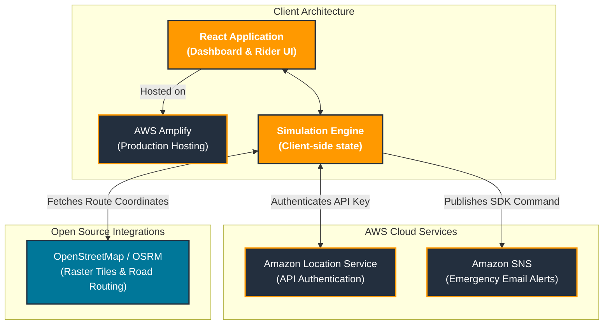

# HeatBudget
Algorithm-Driven Heat Protection & "Pause Pay" for Delivery Fleets

## Problem Statement
Delivery riders in Indian cities work 10-12 hours outdoors, even at 44°C+, and are paid per delivery, so every minute of rest is unpaid. Platforms reward afternoon availability and penalize cancellations, which makes breaks costly. 

Heat alerts only report the temperature. They do not track how much heat each rider has absorbed over a shift, and nothing in dispatch accounts for it. Heat safety rules (Maharashtra SOPs, Karnataka's 2025 gig worker Act) exist, but there is no tool to apply or verify them.

## Objective
Build a dispatch layer that treats heat as a budget:
1. Track each rider's cumulative heat dose during a shift.
2. Assign orders and routes to reduce total heat exposure while keeping earnings and delivery times close to normal.
3. Guide riders to shaded waiting spots and rest points, with a pause credit so rest doesn't cost income.
4. Alert fleet managers when a rider reaches their limit or presses SOS.
5. Generate aggregate compliance reports for platforms and regulators.

Success metric: fewer riders over the heat limit at similar earnings and delivery time, compared with baseline nearest-rider dispatch on the same seeded day.

## Solution Overview
HeatBudget is a dispatch interceptor that monitors rider heat exposure. When a rider approaches critical limits, the engine reroutes them to shaded zones and calculates a financial "Pause Pay" micro-incentive to offset lost income.


## Key Features
* **Rider View:** Mobile UI showing live heat dose, route shading, and nearby rest stops.


* **Dispatch Comparison:** A dual-simulation comparing a baseline dispatch vs. a HeatBudget algorithm-assisted dispatch.
* **Pause Pay:** Calculates financial incentives based on time spent in a designated rest geofence.
* **SOS Alerts:** Manual and automated emergency triggers that push medical alerts to Fleet Managers.
* **Reports:** Dashboard generating aggregate KPI compliance reports.

---

## Technical Architecture & Stack

### 1. Frontend & Simulation (React / TypeScript)
* **Framework:** React 18 with TypeScript, bundled via Vite.
* **Mapping:** `react-leaflet` rendering OpenStreetMap raster tiles, with OSRM fetching real-world road geometries.
* **Simulation:** A 60ms React `useEffect` animation loop that calculates `[lat, lng]` coordinates along the OSRM polyline.
* **Fallback Strategy:** Contains an interception layer that serves client-side mock JSON data when the backend is offline.

### 2. Cloud Integrations (Amazon Web Services)
* **AWS Amplify:** Frontend static hosting and CDN.
* **Amazon Location Service:** Active HTTP verification pings to authenticate API keys.
* **Amazon SNS:** Executes a `PublishCommand` to trigger real-time email alerts to Fleet Managers. (See Limitations regarding frontend execution).

### 3. Backend (Java / Spring Boot)
* **Framework:** Java 17 and Spring Boot 3.4.
* **Database:** PostgreSQL with Flyway for automated schema migrations.
* **Status:** Core REST endpoints and schema migrations are initialized in the repository.

---

## Architecture Diagram




---

## Engineering Phases & API Specification

The core dispatch engine was developed across 8 distinct backend phases:

* **Phase 1: Local Foundation:** Configured Docker environment (`docker compose --env-file .env up -d`) and Spring Boot API. Health endpoints available at `/api/v1/status`.
* **Phase 2: Heat Core:** `GET /api/v1/weather/current` fetches Pune weather with a 15-minute cached Open-Meteo client, returning a clearly labelled WBGT screening estimate. Backed by `WbgtCalculator` and `DoseTracker` services.
* **Phase 3: Rider Tracking API:** `POST /api/v1/riders/shifts` starts consented anonymous tracking. `POST /api/v1/riders/{riderId}/location` records idempotent pings, while `GET /api/v1/riders/{riderId}/dose` returns current heat dose and non-punitive guidance.
* **Phase 4: Seeded Simulator:** `GET /api/v1/sim/scenario?seed=440026` reproduces exact riders and orders deterministically for testing both dispatch strategies.
* **Phase 5: Dispatch Comparison:** `POST /api/v1/dispatch/compare` executes Baseline vs. Pause Pay logic over the scenario. Returns completed orders, late deliveries, soft-limit overrides, and earnings per heat point.
* **Phase 6: Live Dashboard Contract:** `GET /api/v1/dispatch/events` opens an SSE (Server-Sent Events) stream for real-time dashboard updates on every dispatch comparison.
* **Phase 7: AWS Integration:** Optional SNS rest nudges, Bedrock compliance reports, and Secrets Manager via AWS SDK for Java v2.
* **Phase 8: React Dashboard:** Clean light UI with English/Hindi switching, a seeded comparison control, live SSE updates, Rider Safety, and Compliance Report screens. `GET /api/v1/dispatch/map?seed=440026&mode=HEAT_AWARE` supplies simulated riders plus cached OpenStreetMap candidates for benches and drinking-water points in Pune.

---

## Setup and Run Instructions

### Phase 1: Start Data Services (Docker)
1. Copy `.env.example` to `.env` and replace local passwords.
2. Start data services (PostgreSQL/Redis): 
   ```bash
   docker compose --env-file .env up -d
   ```
3. Start the API: 
   ```bash
   mvn spring-boot:run
   ```

### Run without Docker (Demo Mode)
For a frontend demo when Docker/PostgreSQL/Redis are unavailable, start the API with an in-memory H2 database:
```bash
mvn spring-boot:run -Dspring-boot.run.profiles=demo
```
*(Note: This listens on port 9090 and does not preserve rider data after the process stops).*

### Running the Frontend
1. Navigate to the frontend directory:
   ```bash
   cd frontend
   npm install
   ```
2. Configure frontend environment variables in `.env`:
   ```env
   VITE_AWS_ACCESS_KEY_ID=your_access_key
   VITE_AWS_SECRET_ACCESS_KEY=your_secret_key
   VITE_AWS_REGION=ap-south-1
   VITE_AWS_LOCATION_KEY=your_location_service_api_key
   ```
3. Start the React UI:
   ```bash
   npm run dev
   ```

---

## Hackathon Limitations & Next Steps
* **Security (Frontend SNS):** For this demo, we used a tightly scoped, publish-only IAM user on a throwaway topic in the Vite frontend. In production, this moves to an API Gateway + Lambda architecture.
* **Mock Data Fallbacks:** If the Spring Boot backend is offline, the frontend intentionally intercepts API calls and falls back to client-side mock data so the simulation UI can still be demonstrated.
* **Heat Dose Math:** The current simulation uses a simplified linear accumulation model for heat exposure. Production will implement a true cumulative dose model factoring in WBGT estimates, decay, and physical recovery rates.
* **Map Tiles:** We used OpenStreetMap raster tiles because our chosen mapping library (`react-leaflet`) does not natively support AWS Location Service vector tiles.
