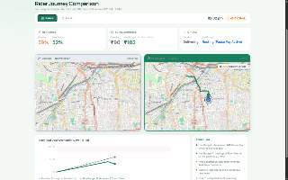
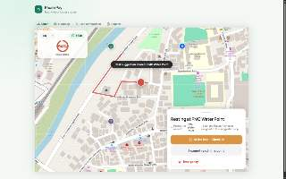
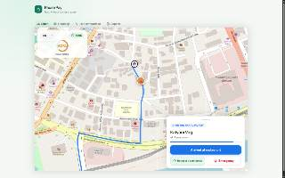

# HeatBudget
Algorithm-Driven Heat Protection & "Pause Pay" for Delivery Fleets

## Problem Statement
Delivery riders in Indian cities work 10-12 hours outdoors, even at 44°C+, and are paid per delivery, so every minute of rest is unpaid. Platforms reward afternoon availability and penalize cancellations, which makes breaks costly. 

Heat alerts only report the temperature. They do not track how much heat each rider has absorbed over a shift, and nothing in dispatch accounts for it. Heat safety rules (Maharashtra SOPs, Karnataka's 2025 gig worker Act) exist, but there is no tool to apply or verify them.

## Objective
Build a dispatch layer that treats heat as a budget:
1. Track each rider's cumulative heat dose during a shift.
2. Assign orders and routes to reduce total heat exposure while keeping earnings and delivery times close to normal.
3. Guide riders to shaded waiting spots and rest points, with a pause credit so rest doesn't cost income.
4. Alert fleet managers when a rider reaches their limit or presses SOS.
5. Generate aggregate compliance reports for platforms and regulators.

Success metric: fewer riders over the heat limit at similar earnings and delivery time, compared with baseline nearest‑rider dispatch on the same seeded day.

## Solution Overview
HeatBudget is a dispatch interceptor that monitors rider heat exposure. When a rider approaches critical limits, the engine reroutes them to shaded zones and calculates a financial "Pause Pay" micro‑incentive to offset lost income.



## Key Features
* **Rider View:** Mobile UI showing live heat dose, route shading, and nearby rest stops.  
  <br>  
  <br>
* **Dispatch Comparison:** A dual‑simulation comparing a baseline dispatch vs. a HeatBudget algorithm‑assisted dispatch.
* **Pause Pay:** Calculates financial incentives based on time spent in a designated rest geofence.
* **SOS Alerts:** Manual and automated emergency triggers that push medical alerts to Fleet Managers.
* **Reports:** Dashboard generating aggregate KPI compliance reports.

---

## Technical Architecture & Stack

### 1. Frontend & Simulation (React / TypeScript)
* **Framework:** React 18 with TypeScript, bundled via Vite.
* **Mapping:** `react-leaflet` rendering OpenStreetMap raster tiles, with OSRM fetching real‑world road geometries.
* **Simulation:** A 60 ms React `useEffect` animation loop that calculates `[lat, lng]` coordinates along the OSRM polyline.
* **Fallback Strategy:** Interception layer that serves client‑side mock JSON when the backend is offline.

### 2. Cloud Integrations (Amazon Web Services)
* **AWS Amplify:** Frontend static hosting and CDN.
* **Amazon Location Service:** Active HTTP verification pings to authenticate API keys.
* **Amazon SNS:** Executes a `PublishCommand` to trigger real‑time email alerts to Fleet Managers. (See Limitations regarding frontend execution).

### 3. Backend (Java / Spring Boot)
* **Framework:** Java 17 and Spring Boot 3.4.
* **Database:** PostgreSQL with Flyway for automated schema migrations.
* **Status:** Core REST endpoints and schema migrations are initialized in the repository.

---

## Architecture Diagram


```mermaid
flowchart TD
    classDef frontend fill:#FF9900,stroke:#232F3E,stroke-width:2px,color:#fff,font-weight:bold
    classDef aws fill:#232F3E,stroke:#FF9900,stroke-width:2px,color:#fff
    classDef external fill:#007799,stroke:#232F3E,stroke-width:2px,color:#fff

    subgraph Client [Client Architecture]
        AMP["AWS Amplify<br>(Production Hosting)"]:::aws
        UI["React Application<br>(Dashboard & Rider UI)"]:::frontend
        SIM["Simulation Engine<br>(Client-side state)"]:::frontend
    end

    subgraph AWS Cloud [AWS Cloud Services]
        ALS["Amazon Location Service<br>(API Authentication)"]:::aws
        SNS["Amazon SNS<br>(Emergency Email Alerts)"]:::aws
    end

    subgraph External [Open Source Integrations]
        OSM["OpenStreetMap / OSRM<br>(Raster Tiles & Road Routing)"]:::external
    end

    UI -->|Hosted on| AMP
    UI <--> SIM
    SIM <-->|Authenticates API Key| ALS
    SIM -->|Publishes SDK Command| SNS
    SIM <-->|Fetches Route Coordinates| OSM
## Hackathon Limitations & Next Steps

- **Security (Frontend SNS)**  
  The demo uses a tightly scoped, publish‑only IAM user in the Vite frontend. Production will move SNS calls behind an API Gateway + Lambda layer.

- **Mock Data Fallbacks**  
  If the Spring Boot backend is unavailable, the frontend intercepts calls and serves static mock JSON, guaranteeing demo uptime.

- **Heat Dose Model**  
  Current simulation uses linear accumulation. Future work will implement a true cumulative dose model with WBGT‑based decay and recovery.

- **Map Tiles**  
  OpenStreetMap raster tiles are used because `react‑leaflet` does not support AWS Location Service vector tiles.

- **Backend Services Not Yet Integrated**  
  Redis caching, Caffeine, Secrets Manager, and Bedrock are present in `pom.xml` but not yet wired into the demo flow.

---

## Setup and Run Instructions

### Phase 1 – Start Data Services (Docker)

```bash
# 1️⃣ Copy env template
cp .env.example .env   # edit the passwords as needed

# 2️⃣ Spin up PostgreSQL & Redis
docker compose --env-file .env up -d

# 3️⃣ Launch the Spring Boot API (default port 8080)
mvn spring-boot:run
